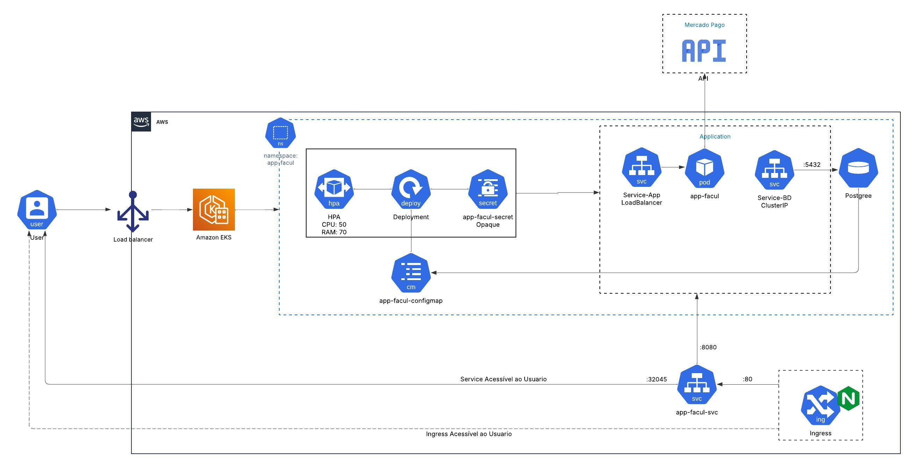
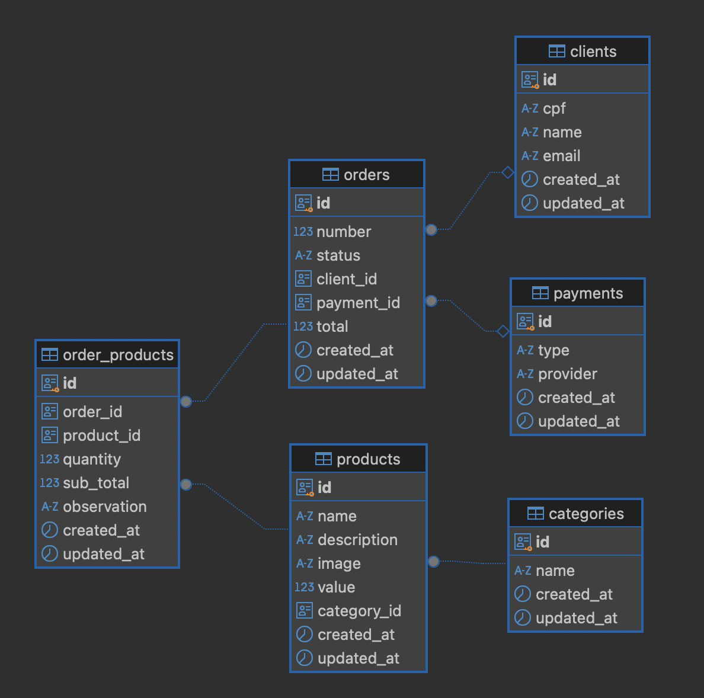

# Desafio Pós-Tech FIAP - API de Gerenciamento de Pedidos

Este projeto implementa uma API RESTful em Go para servir um sistema de pedidos, onde será possível gerenciar clientes, produtos e pedidos, como parte do desafio Pós-Tech em Arquitetura de Software da FIAP. A aplicação utiliza Docker e Docker Compose para facilitar a execução e o desenvolvimento, integrando-se com um banco de dados PostgreSQL.

### Demonstração da Arquitetura e APIs

- Link do vídeo Estrutura: [Ver vídeo no Google Drive](https://drive.google.com/file/d/1ikbIZKveirlwd96y9aIGhZ5pxSetaFza/view?usp=sharing)


## 1. Desenho da Arquitetura

### 1.1 Requisitos do Negócio
O problema identificado é a ausência de um sistema de controle de pedidos, gerando confusão e insatisfação dos clientes em uma lanchonete que está em expansão. O novo sistema proposto busca **organizar e otimizar os fluxos de pedidos e atendimento**, trazendo benefícios como:

- Garantir uma experiência otimizada para os clientes com um sistema de autoatendimento eficiente.
- Minimizar erros no processo de registro e preparo dos pedidos, aumentando a precisão das informações repassadas à cozinha.
- Melhorar os tempos de preparo e entrega dos pedidos, enfocando a satisfação do cliente.
- Fornecer ao administrador meios para gerenciar clientes, pedidos e produtos com maior controle.

### 1.2 Requisitos de Infraestrutura
A ideia é que em breve a solução seja provisionada no **Amazon Elastic Kubernetes Service (EKS)**, garantindo escalabilidade, alta disponibilidade e automação no gerenciamento dos recursos. Os principais recursos que serão utilizados incluem:

- **Cluster Kubernetes** no **Amazon Elastic Kubernetes Service (EKS)**.
- **NodeGroup gerenciado**: Automatização dos nós para otimizar recursos e garantir alta disponibilidade;
- **Ingress Controller**: Implementado com **NGINX** para gerenciamento de tráfego de entrada;
- **Secrets**: Para essa primeira versão vamos utilizar de secret, para gerir a conexão do postgres. Posteriormente, a ideia é utilizar de external secret via secrets manager por exemplo;
- **Autoscaler configurado**: Escala os recursos automaticamente com base na demanda por meio do HPA e o uso de memória e CPU de cada pod;
- **Monitoramento de recursos ativado**: Observação contínua utilizando metrics server `kubectl top`.

Para fim de exemplo prático e testes em ambiente local, foi utilizado do minikube para gerar o ambiente kubernetes.

### 1.3 Representação da Arquitetura

Segue o **diagrama de arquitetura** utilizado para representar a solução proposta: 



### 1.4 Organização do projeto

A API inicialmente adotou-se para a Fase 01 arquitetura Hexagonal, e nesse momento para a Fase 02 tem sua base na Clean Architecture, tendo a seguinte estrutura:

* **Controllers:** Aqui é onde temos os controllers de nossa aplicação, que serão utilizados para orquestrar nossos casos de uso e que serão utilizados por nossos handles para como porta de entrada;
* **Delivery:** Em delivery, temos nossa comunicação http:
  * **Handler** Aqui ficam os handler https, que serão utilizados no mapeamento de qual método será chamado para determinado endpoint;
  * **Mapper** Os mappers, tem como responsabilidade adaptar o retorno de nossos endpoints para JSON;
* **DTO:** Aqui onde mantemos structs que tem papel apenas de servirem para trafego de dados, mas que não tem regras de negocio relacionadas;
* **Interfaces:** Aqui onde definimos todas as interfaces que serviram como base para nossas implementaçōes, tanto para módulos internos como nossos gateways, quanto para repositórios e acesso a fonte de dado e representar outros clients que serão implementados;
* **External:** Toda comunicação externa da aplicação fica aqui:
  * **Clients** Os clients são nossa camada de implementação para comunicação com outros serviços, para esse momento temos como seria ao integrar com o mercado pago com base em uma interface que foi definida.
  * **Database** Aqui temos a implentação de nosso banco de dados sendo o Postgres:
    * **Migrations** Migrations que serão executadas para gerar nossa base de dados;
    * **Model** Os models que representam as tabelas do banco;
    * **Repostiories** Implementação de nossas interfaces de repository que se comunicam com o banco de dados;
* **Gateways:** Onde mantemos a camada de gateway que servem como ponte para disponibilizar aos casos de uso o acesso aos repositorios, servindo de abstração;
* **Infrastructure:** Manter a parte de infraestrutura da aplicação:
  * **Config** Arquivos base de configuração, como carregamento de variáveis de ambiente;
  * **DI** Aqui temos onde ocorre a injeção de dependência de cada struct, onde criamos todas as instâncias e passamos para seus respectivos dependentes;
  * **Logger** Configuração de log da aplicação;
* **Usecases:** Os casos de uso são onde aplicamos nossas regras de negócio e que representam os problemas que queremos resolver, juntamente de conhecer diretamente quais entidades utilizamos;
* **Entities:** Nossas entidades são a representação do negócio, onde delimitamos nossos contexto e representamos em estruturas;

### 1.5 Banco de dados
Para garantir o armazenamento de dados, foi definido o uso de banco de dados relacional por meio do Postgres, no qual temos a seguinte modelagem:



### 1.6 Tecnologias Utilizadas

* **Go:** Linguagem de programação utilizada para desenvolver a API.
* **Gin:** Framework web para Go, utilizado para roteamento e manipulação de requisições HTTP.
* **PostgreSQL:** Banco de dados relacional para persistência dos dados.
* **Docker:** Plataforma para empacotamento e execução da aplicação em containers.
* **Docker Compose:** Ferramenta para orquestrar múltiplos containers Docker.
* **Swagger:**  Para documentação da API.

## 2. Collection de APIs

A collection das APIs foi listada e documentada no Swagger do projeto.

- **Link para o Swagger da aplicação:** http://localhost:8080/docs/index.html

## 3. Guia de Execução do Projeto

### Pré-requisitos

* Docker
* Docker Compose

### Passos

1. **Clone o repositório:**
   ```bash
   git clone https://github.com/seu-usuario/pos-tech-challenge-10soat.git


2. **Navegue até o diretório do projeto:**
   ```bash
   cd pos-tech-challenge-10soat
   

3. **Inicie a aplicação com Docker Compose:**
   ```bash
   docker-compose up -d --build

Este comando irá:

Construir a imagem Docker da aplicação a partir do Dockerfile.
Criar os containers para a aplicação (postech) e o banco de dados (postgres).
Iniciar os containers em modo detached (-d), executando em segundo plano.


4. **Verifique os logs da aplicação:**
   ```bash
   docker-compose logs -f postech

5. **Parando a aplicação:**
   ```bash
   docker-compose down

6. **Acesse a API: A API estará disponível em http://localhost:8080/v1/(endpoints)**

7. **Documentação da API (Swagger): A documentação da API está disponível em http://localhost:8080/docs/index.html**


**Docker**

***Dockerfile***

O Dockerfile define como a imagem Docker da aplicação é construída. Ele utiliza uma imagem base do Go, copia o código-fonte, instala as dependências, compila a aplicação e configura o ponto de entrada. (Veja o arquivo Dockerfile para detalhes).

***Docker Compose***

O docker-compose.yaml define os serviços que compõem a aplicação, incluindo a API (postech) e o banco de dados (postgres). Ele especifica a construção da imagem, as portas que serão mapeadas, as dependências entre os serviços e as variáveis de ambiente. (Veja o arquivo docker-compose.yaml para detalhes).

**Contribuição**

Contribuições são bem-vindas! Sinta-se à vontade para abrir issues e pull requests.

**Melhorias Futuras**

Implementar paginação para endpoints que retornam listas.
Aprimorar o tratamento de erros, fornecendo mensagens mais detalhadas.
Adicionar mais testes unitários e de integração.
Implementar mecanismos de autenticação e autorização.
Implementar logging mais robusto e estruturado.
Considerações de Segurança
Senha do Banco de Dados: A senha do banco de dados deve ser gerenciada com segurança, idealmente utilizando Docker Secrets (recomendado para produção) ou, no mínimo, através de um arquivo .env que não seja versionado.
Este README atualizado fornece uma visão geral mais completa do projeto, incluindo informações sobre a arquitetura, tecnologias utilizadas, configuração, execução, testes e considerações de segurança.

